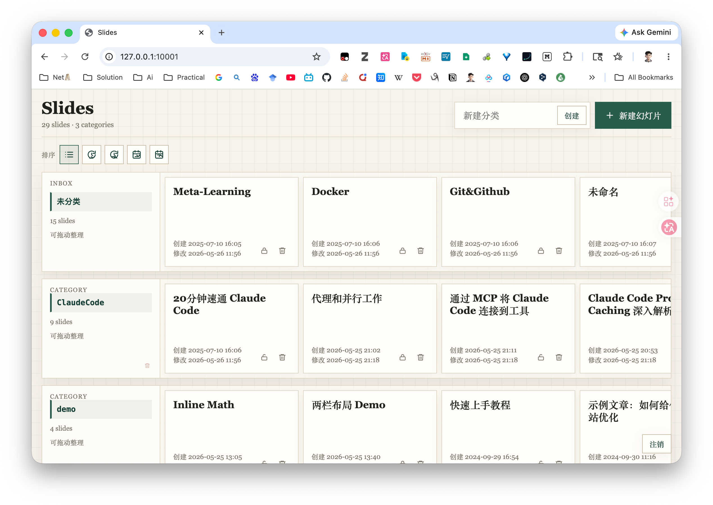

<div align="center">


# 🎨 EasySlides

### 在浏览器里用 Markdown 写出 [jyy 老师](https://jyywiki.cn) 同款风格的 Reveal.js 幻灯片

**左边敲 Markdown，右边实时变幻灯片** —— 自动保存、实时预览、拖拽排序、一键公开、AI 代写，开箱即用。

<br>

[](http://slide.yuyu.pub/public/)
[](SLIDE_SYNTAX.md)

<br>


</div>

> [!NOTE]
> 本项目基于 [xieyumc/jyySlideWeb](https://github.com/xieyumc/jyySlideWeb) 修改而来，原作者保留所有权利。本 fork 修复了若干 bug 并添加了大量新功能（`:::` 块级指令、CodeMirror 6 编辑器、分类拖拽、AI Skill 等）。

---

## ✨ 核心功能一览

| | 功能 | 说明 |
|:---:|---|---|
| ⚡ | **实时双栏转换** | 左边敲 Markdown，右边毫秒级渲染出 Reveal.js 幻灯片，所见即所得 |
| 🎯 | **编辑位置同步预览** | 右侧预览自动跟随左侧光标，跳到你正在编辑的那一页 |
| 💾 | **自动保存** | 每分钟自动保存，关闭窗口 / 返回主页时也会自动落库，永不丢稿 |
| 🏷️ | **自动读取标题** | 标题由正文第一个 `#` 自动提取，无需额外填写 |
| 🖼️ | **拖拽 / 粘贴上传图片** | 拖入或 `Ctrl+V` 粘贴图片即自动上传并插入 Markdown 链接 |
| 🧩 | **CodeMirror 6 源码编辑器** | 高亮的 Markdown 源码视图，标题 / 粗体 / 链接 / 代码块 / 列表 / 分割线视觉增强 |
| 🔓 | **一键公开分享** | 幻灯片默认加锁；点一下锁即变为只读公开页，无需密码即可访问 |
| 🗂️ | **分类 + 拖拽排序** | 卡片分门别类（Inbox / 自定义分类），跨栏拖拽移动、栏内调序 |
| 🧱 | **扩展 Markdown 方言** | `:::columns / note / tip / warning / danger / success / incremental / timeline / notes` |
| 🤖 | **AI 代写 Skill** | 内置 Claude Code skill，对话一句「帮我做一份关于 X 的幻灯片」即可落库 |

<br>

---

## 🖥️ 功能演示




### ⚡ 实时转换

左边输入 Markdown，右边可以实时看到生成的效果。

### 🎯 预览自动跟随编辑位置
右侧幻灯片预览会和左侧编辑位置实时对应，方便随手查看效果。

### 💾 自动保存
编辑时每分钟自动保存一次，关闭窗口、返回主页都会自动保存。

### 🏷️ 自动读取标题
幻灯片标题自动从正文第一个 `#` 标题提取。

### 🖼️ 快捷插入图片
直接拖拽或 `Ctrl+V` 粘贴图片到编辑器，图片自动上传到服务器并以 Markdown 格式插入。


### 🧩 CodeMirror 6 源码模式编辑器
高亮显示的 Markdown 源码视图替代普通文本框，提供专业流畅的编辑体验，对标题、粗体、链接、代码块、列表和分割线做视觉增强，同时保持 Markdown 语法可见。


### 🔓 公开分享幻灯片
幻灯片默认需要密码访问，也可设为公开来分享，公开模式下为只读。

### 🗂️ 分类与拖拽排序
将幻灯片卡片分门别类整理（如 Inbox 和自定义分类），支持跨分类栏拖拽移动卡片或栏内调整顺序。


<br>

---

## 🧱 扩展 Markdown 方言：`:::` 块级指令 + 内联格式

在原有 jyy 语法（`---` / `----` / `++++` / `--`）基础上，新增了一组 `::: <keyword> ... :::` 块级指令，覆盖技术分享 / 学术汇报常见排版需求：

| 指令 | 用途 |
|---|---|
| `:::columns 40/60` | 单页内左右 / 多列布局，CSS Grid `fr` 自动归一化比例（`1/2`、`30/30/40` 都行） |
| `:::note` `:::tip` `:::warning` `:::danger` `:::success` | 五种配色提示框，支持自定义标题与内嵌 Markdown |
| `:::incremental` | 列表逐条揭示（替代连绵 `--` fragment） |
| `:::timeline` | 时间线（`- DATE: EVENT` 格式，三栏对齐 + 圆点 + halo） |
| `:::notes` | 演讲者备注（听众看不到） |

支持任意嵌套（提示框里套分栏、分栏里套提示框都行），代码栅栏内的 `:::` 字面量原样保留，未知关键字降级为普通文本不报错。

同时启用了一批 Markdown 扩展：`==高亮==`、`H~2~O` 下标、`E=mc^2^` 上标、`:rocket:` emoji 短代码、`- [x]` 任务列表、`[^1]` 脚注、定义列表，行内 / 行间数学公式由 **KaTeX** 渲染（`$…$` / `$$…$$`）。

> 📖 完整语法手册见 **[SLIDE_SYNTAX.md](SLIDE_SYNTAX.md)**；新建幻灯片时的默认模板里也带有所有方言的范例。

<br>

---

## 🤖 用 AI 写幻灯片：jyy-slides Claude Code Skill

仓库内置了一个 [Claude Code](https://docs.claude.com/en/docs/claude-code) skill —— [`.claude/skills/jyy-slides`](.claude/skills/jyy-slides)，让 LLM 直接按 jyy 方言写稿并落库。

- **🎯 自动遵循语法**：skill 以 [SLIDE_SYNTAX.md](SLIDE_SYNTAX.md) 为唯一权威，内置分隔符禁区与生成前自检清单，避免最常见的解析翻车。
- **🛡️ 安全读写数据库**：附带 `scripts/slide_db.py`，对 `slideapp_slide` 表做 list / get / create / update / delete / publish，从文件或 stdin 读 content，规避引号转义并正确填充 `html_cache` / `content_hash`。

```bash
SD=.claude/skills/jyy-slides/scripts/slide_db.py
python3 $SD list                                                  # 列出全部幻灯片
python3 $SD create --title "标题" --category demo --file slide.md  # 从文件建一张
python3 $SD update <id> --file slide.md                           # 覆盖内容
python3 $SD publish <id>                                          # 解锁公开
```

在仓库目录里用 Claude Code 说「**帮我做一份关于 X 的幻灯片**」即可触发。

<br>

---

## 🖥️ 终端预览器（TUI）

一个 clack 风格（同 `@clack/prompts`）的内联终端流程，用来快速浏览幻灯片并一键打开公开预览：

```bash
./tui.sh
```

```
┌  EasySlides · 幻灯片预览器
│
●  数据库  db.sqlite3  ·  运行中(托管) :10001
│
◆  选择幻灯片            ↑↓ 移动 · ↵ 预览 · d 切库 · q 退出
│
│  ● #112  🌐  快速上手教程               v3
│  ○ #113  🔒  深入浅出 PyTorch           v1
│  ○ …
└  ↵ 在浏览器打开 /public 预览
```

- **顶部常驻显示当前数据库**（名称 + 路径 + 服务状态 + 幻灯片数）。
- **方向键选择幻灯片，回车** 直接在浏览器打开该页的 `/public/edit/<id>/` 预览；锁定的幻灯片会**自动解锁后再打开**。
- **按 `d` 切换数据库**：列出仓库根与 `archive/` 下的所有 `*.sqlite3`（带大小/张数），切换会用所选库**重启后端服务**（带 ◒ 加载动画），预览内容随之切换。
- 其它按键：`r` 刷新、`q` 退出（退出时自动回收它启动的服务进程）。

> TUI 通过 `SLIDES_DB` 环境变量让 Django 指向所选数据库（未设置时仍用默认 `db.sqlite3`）。它会托管 **10001** 端口上的 daphne 服务——若该端口已被你手动启动的服务占用，TUI 会提示并停用切库功能。预览要求所选数据库的表结构与当前版本一致（过旧的备份库可列出但预览可能报错）。

<br>

---

## 🛠️ 技术栈

| 层 | 技术 |
|---|---|
| **后端框架** | Django + Django Channels（WebSocket 实时通信） |
| **ASGI 服务** | Daphne（支持 HTTP/2 + TLS） |
| **渲染管线** | Python-Markdown + pymdown-extensions + Pygments 代码高亮 |
| **数学公式** | KaTeX |
| **幻灯片引擎** | Reveal.js |
| **前端编辑器** | CodeMirror 6 |
| **数据库** | SQLite（`db.sqlite3`） |
| **静态资源** | WhiteNoise |
| **部署** | Docker / docker-compose + Watchtower 自动更新 |

<br>

---

## 📦 快速安装

> 本项目可以在任何平台运行：Windows 平台有编译好的 exe，其他平台推荐用 Docker。

<details>
<summary><b>🪟 Windows：直接运行编译好的 exe</b></summary>

<br>

在 [release](https://github.com/xieyumc/jyySlideWeb/releases) 页面下载 `easy_slides.zip`，**完整解压**（不要只解压 exe），打开 `easy_slides.exe` 即可运行。

> ⚠️ 这种方式实时转换效率较低、转换较慢，正在尝试解决，欢迎 PR。

项目运行在本地 **10001** 端口，接下来参考 [快速上手](#-快速上手)。

- 文章数据存储在 `_internal` 文件夹的 `db.sqlite3` 文件中
- 上传的图片在 `_internal` 文件夹的 `media` 文件夹中
- 升级软件后迁移数据，只需复制这两个文件夹即可

</details>

<details>
<summary><b>🐳 Docker 安装（推荐）</b></summary>

<br>

在仓库根目录下载：

- [docker-compose.yml](docker-compose.yml)
- [db.sqlite3](db.sqlite3)

然后在本地创建一个 `media` 文件夹（存放上传图片）。目录结构应为：

```
├── docker-compose.yml
├── db.sqlite3
└── media
    └── xxx.img
```

在 [docker-compose.yml](docker-compose.yml) 中修改 CSRF 信任域：

```yaml
environment:
  - CSRF_TRUSTED_ORIGINS=https://localhost,https://yourdomain.com  # 定义CSRF信任域
```

如果你的域名是 `yourdomain.com`，把 `https://yourdomain.com` 改成你的域名（不使用 https 可不设置）。然后运行：

```bash
docker-compose up
```

项目运行在本地 **10001** 端口，借助 watchtower 会自动更新容器。接下来参考 [快速上手](#-快速上手)。

</details>

<details>
<summary><b>📜 从源码安装</b></summary>

<br>

```bash
# 1. 下载源码并切换到项目根目录
# 2. 安装依赖
pip install -r requirements.txt
# 3. 启动（本地端口 10001）
daphne -p 10001 easy_slides.asgi:application
```

接下来参考 [快速上手](#-快速上手)。

</details>

<br>

---

## 🚀 快速上手

### 1️⃣ 访问主页和修改密码

安装好后访问 `http://localhost:10001/` 即可进入主页。

- 默认账号：`admin`
- 默认密码：`admin@django`

修改密码请访问 `http://localhost:10001/admin/`，点击右上角的 `Change password`。

### 2️⃣ 编写幻灯片

访问 `http://localhost:10001/`，点击 **新建幻灯片**。


内置两张教程幻灯片，可直接配合内容学习基础语法。

### 3️⃣ 分享幻灯片

每张幻灯片创建时默认上锁（左上角的锁）：

点击左上角的锁，幻灯片即变为公开。访问 `http://localhost:10001/public/` 可看到所有公开幻灯片（无需密码）。公开模式下幻灯片只读，直接进入全屏展示。

<br>

---

## ⚙️ 配置 Nginx

由于本项目使用了 WebSocket，反向代理需要一些特殊设置。

<details>
<summary><b>HTTP 配置</b></summary>

```nginx
server {
    listen 80;
    server_name yourdomain.com;  # 填写你的域名

    location / {
        proxy_pass http://127.0.0.1:10001;
        proxy_set_header Host $host;
        proxy_set_header X-Real-IP $remote_addr;
        proxy_set_header X-Forwarded-For $proxy_add_x_forwarded_for;
        proxy_set_header X-Forwarded-Proto $scheme;
        proxy_set_header Referer $http_referer;
        proxy_set_header Origin $http_origin;

        # WebSocket 特别配置
        proxy_http_version 1.1;
        proxy_set_header Upgrade $http_upgrade;
        proxy_set_header Connection "upgrade";
    }
    # 为 /static 路径的静态资源设置缓存策略
    location /static/ {
        proxy_pass http://127.0.0.1:10001;  # 代理到后端服务器
        proxy_set_header Host $host;
        proxy_set_header X-Real-IP $remote_addr;
        proxy_set_header X-Forwarded-For $proxy_add_x_forwarded_for;
        proxy_set_header X-Forwarded-Proto $scheme;
        proxy_set_header Referer $http_referer;
        proxy_set_header Origin $http_origin;

        # 设置浏览器缓存头，缓存30天
        expires 30d;
        add_header Cache-Control "public, max-age=2592000";
        # 允许跨域（如果需要）
        add_header Access-Control-Allow-Origin *;
        # 禁用日志（可选，减少日志量）
        access_log off;
    }
}
```

</details>

<details>
<summary><b>HTTPS + HTTP/3 配置</b></summary>

```nginx
server {
        listen 443 ssl;
        listen 443 quic;
        listen [::]:443 quic;
        http2 on;

        server_name yourdomain.com;  # 填写你的域名

        ssl_certificate /etc/nginx/certs/       # 你的SSL证书
        ssl_certificate_key /etc/nginx/certs/   # 你的SSL证书
        ssl_protocols TLSv1.2 TLSv1.3;
        ssl_ciphers HIGH:!aNULL:!MD5;

        location / {
            proxy_pass http://127.0.0.1:10001;
            proxy_set_header Host $host;
            proxy_set_header X-Real-IP $remote_addr;
            proxy_set_header X-Forwarded-Host $host;
            proxy_set_header X-Forwarded-For $proxy_add_x_forwarded_for;
            proxy_set_header X-Forwarded-Proto $scheme;
            proxy_set_header Referer $http_referer;
            proxy_set_header Origin $http_origin;

            # WebSocket 特别配置
            proxy_http_version 1.1;
            proxy_set_header Upgrade $http_upgrade;
            proxy_set_header Connection "upgrade";
            add_header Alt-Svc 'h3=":443"; ma=86400';
        }

        # 为 /static 路径的静态资源设置缓存策略
        location /static/ {
            proxy_pass http://127.0.0.1:10001;  # 代理到后端服务器
            proxy_set_header Host $host;
            proxy_set_header X-Real-IP $remote_addr;
            proxy_set_header X-Forwarded-Host $host;
            proxy_set_header X-Forwarded-For $proxy_add_x_forwarded_for;
            proxy_set_header X-Forwarded-Proto $scheme;
            proxy_set_header Referer $http_referer;
            proxy_set_header Origin $http_origin;

            # 设置浏览器缓存头，缓存30天
            expires 30d;
            add_header Cache-Control "public, max-age=2592000";
            # 允许跨域（如果需要）
            add_header Access-Control-Allow-Origin *;
            # 禁用日志（可选，减少日志量）
            access_log off;
            add_header Alt-Svc 'h3=":443"; ma=86400';
        }
    }
```

</details>

<br>

---

## 🙏 致谢

- 灵感来源：南京大学 [jyy 老师](https://jyywiki.cn)
- 转换逻辑基于 [jyyslide-md](https://github.com/zweix123/jyyslide-md)，感谢大佬已经把转换逻辑完善
- 原项目：[xieyumc/jyySlideWeb](https://github.com/xieyumc/jyySlideWeb)

<div align="center">

<br>

**如果这个项目对你有帮助，欢迎点一个 ⭐ Star！**

</div>
